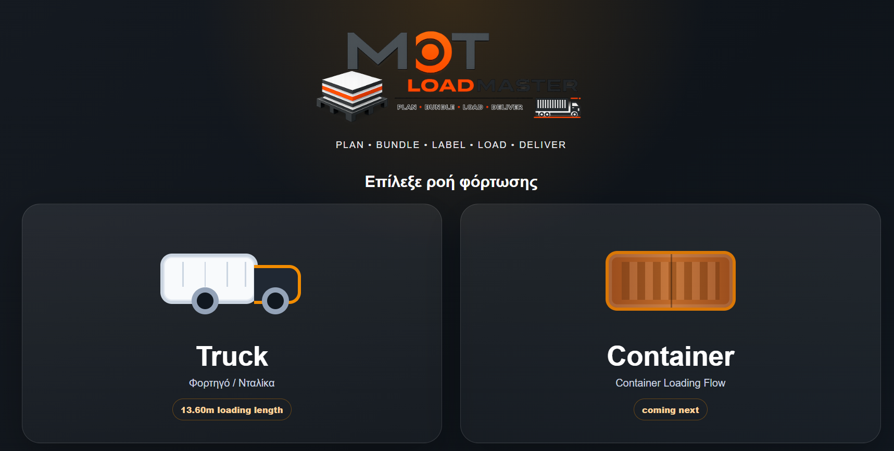
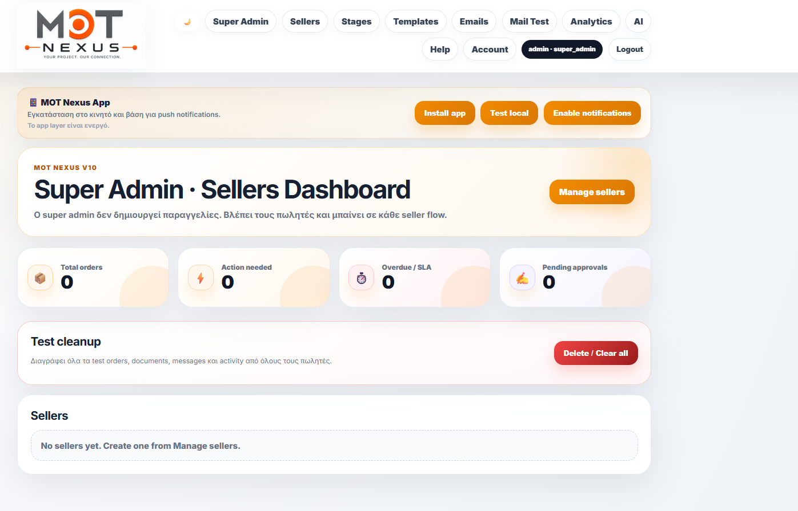
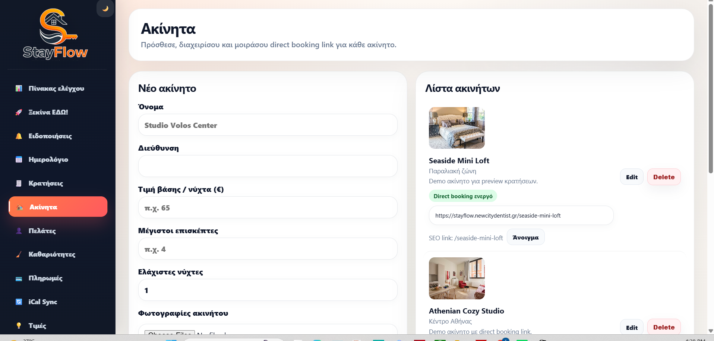

# WorkflowDock

## ## Custom Software, SaaS Platforms & Operational Systems

WorkflowDock develops software platforms that automate workflows, improve operational efficiency and simplify complex business processes.

Our work spans manufacturing, logistics, healthcare, property management, analytics, automation and digital business operations.

---

# Featured Projects

## 🚢 LoadMaster

Production, Packaging & Container Loading Platform

Industrial software for manufacturers and logistics teams.

### Project Link

https://github.com/workflowdock/loadmaster

---

## 📋 Nexus

Business Workflow & Approval Management Platform

Approval workflows, customer portals and digital signatures.

### Project Link

https://github.com/workflowdock/nexus

---

## 🏠 StayFlow

Property Operations & Booking Management Platform

Booking operations, property management and calendar synchronization.

### Project Link

https://github.com/workflowdock/stayflow

---

## 🦷 DentNow

Healthcare Availability & Emergency Request Platform

Coming Soon.

---

# Services

- Custom Business Software Development
- SaaS Platform Development
- Workflow Automation
- Internal Business Systems
- Manufacturing & Logistics Solutions
- Property Management Platforms
- Healthcare Operations Software
- Analytics & Reporting Systems

---
# Additional Solutions

## Business Management Systems

### Dental Practice Manager
Dental office management platform with X-Ray distribution, review requests, finance tracking, patient history and document workflows.

---

## Analytics & Automation

### Analytics Suite
Website analytics, visitor tracking and reporting tools.

### Auto SEO
Automated SEO optimization plugin.

### Rank Viewer
SEO rank monitoring and keyword tracking tool.

### Daily Report
Automated business reporting system.

---

## Learning Platforms

### BA Learning Platform
Business Analytics training platform with lessons, quizzes, progress tracking and performance analytics.

---

## Industrial Operations

### MoT Order Forms
Order management and product configuration tools for industrial panel workflows.

---

## Websites & Digital Presence

### Creamplug
E-commerce website.

### Blue Jeans Barber
Business website.

### NewCityDentist
Healthcare website.

### MoTPanels.com
Industrial corporate website.

---

# Technology Stack

- PHP
- MySQL
- JavaScript
- HTML5
- CSS3
- REST APIs
- Cron Automation
- WordPress Development
# Contact

📧 dev@workflowdock.dev
